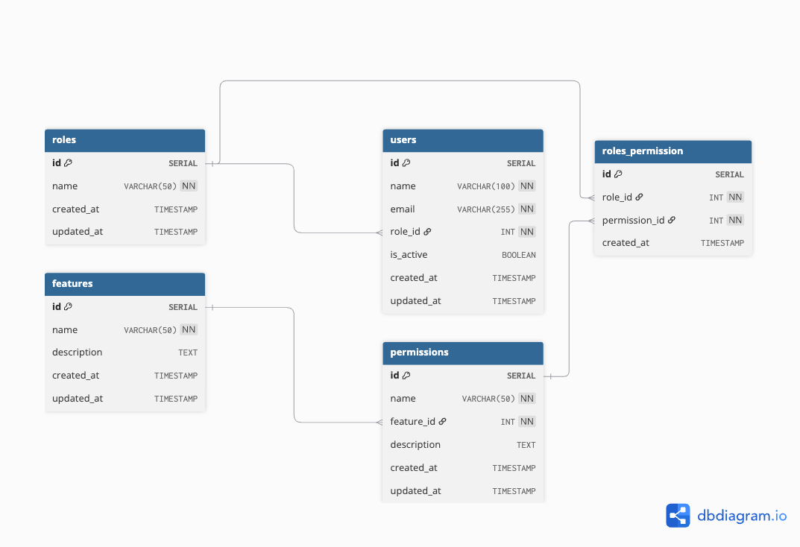

# User Management System

Simple PHP application for managing users and roles with permissions.

## Features

- User and role management
- Permission system with CRUD operations
- Authentication
- CSRF protection
- PostgreSQL support

## Database Diagram



## Quick Start

1. Set up database config at `db/config.php`:

```php
<?php

return [
    'host' => '127.0.0.1',
    'port' => 5432,
    'user' => 'postgres',
    'password' => '',
    'dbname' => 'usermgr',
];

```

2. Migrate database:

```bash
php db/migrate.php
```

3. Composer Install

```bash
composer install
```

4. Start server:

```bash
php -S localhost:8000 -t public/ server.php
```
